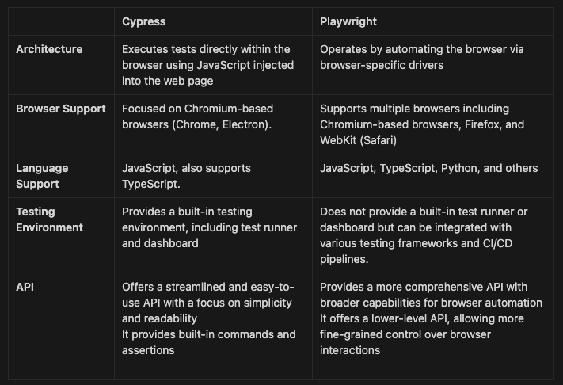
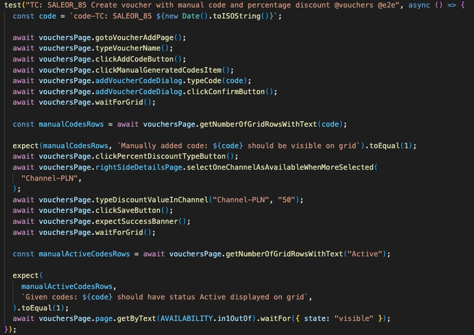
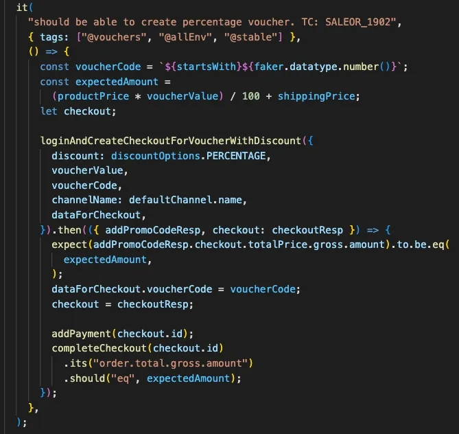

This is the story of our path from our early days of automated testing, to adapting to new tools, and finally to where we stand today with a more robust and efficient testing framework.

Saleor recently migrated our end-to-end test suite from Cypress to Playwright. In this article we share our journey, the challenges we encountered, and how the transition unfolded.

The decision to make the switch from one tool to another is never taken lightly. It needs to be carefully weighed up as it can impact the entire workflow and stability of our projects.

## How it started

Let's take a trip back to 2020. It's the beginning of the pandemic and I'm diving into adding the first storefront end-to-end tests written in Cypress. Back then, we didn't have a CI/CD setup - GitHub history shows that our deployment workflow was established in 2021.

## Why we decided to use Cypress in 2020

Well, one thing was certain, we needed automation. There weren't many tools to choose between on the market, so the decision was straightforward. Selenium's ongoing problems with drivers and debugging made it a no-go for us. Cypress was more user-friendly and was on top at the time - the future seemed bright for end-to-end automation.

As the years passed, our QA team grew and we had more and more tests. Around 2022 we decided to upgrade to the paid version of Cypress to use the dashboard (now Cloud). It was a significant improvement for us, finally we could run tests in parallel!

Test results were visible, we did some automation with Github. We are still using bots that tell us if the release has some failed tests or not.

## Playwright was on the horizon

As with every successful tech company, we keep an eye on 'new-tech' news. Playwright was gaining some attention and I became intrigued by this new tool. I was also a bit hesitant - with Playwright being a new tool, the community was only just starting to grow. In comparison, Cypress was more mature and well-documented, the community was more established, and we had experience with it.

Even though we had encountered slowdowns and issues with Cypress, I was wary of making a rushed decision to switch test frameworks. Also, who would find the time to rewrite all our Cypress tests to Playwright?!

Day by day, article by article, it became clear that we would eventually need to make the move. We were running tests so frequently and across so many versions that the cost of Cypress Cloud was becoming prohibitive. We tasked one of our QA team members to experiment with PW in their project. Tests ran faster, and a lot of the issues we experienced with Cypress seemed to vanish.

## Cypress vs Playwright

Let's take a look at a comparison between the two:

## Test structures

Let's compare the test structures in Playwright and Cypress.

At first, you can notice that PW uses `test` to define the test case and `expect` from its testing library for assertions.

Cypress uses `it` to define the test case and Chai (`expect`) for assertions.

As you can see, the test code looks different. Playwright uses a way of writing code called async/await, which is built into JavaScript. Cypress, on the other hand, has its own method for dealing with tasks that happen at different times, so you don't always need async/await. Assertions with PW uses Jest's library, whereas Cypress uses its built-in assertion library, powered by Chai.

Additionally, Playwright features a built-in auto-wait strategy. If the anticipated checks fail to materialize within the designated timeout, the action is flagged with a TimeoutError, mitigating flakiness. In contrast, Cypress is engineered to wait automatically for elements to be present in the Document Object Model (DOM) prior to executing actions such as clicking or form submission. However, this can extend the test duration.

One of the advantages of PW is iFrame support, Cypress has problems with that which leads to having to do workarounds.

These examples give you an idea of how Cypress and Playwright differ, but there's much more to explore.

## Decision and struggling

So, in the middle of 2023, I began discussing the transition to PW with the QA team. We prioritized rewriting the most critical paths first and then tackled less critical but still important tests. During this refactor, we also cleaned up our tests, reducing the number of end-to-end tests in favor of more integration tests.

As of 2024, we're still grappling with some configuration and workflow issues.

Our first challenge was adding new workflows for running Playwright on the main branch, on pull requests and keeping workflows for Cypress since we still support older versions of Saleor. We want to keep posting test results on Slack and receive concise information about whether tests pass or fail on the release pull request.

Currently each pull request trigger the Playwright tests in parallel. This ensures us that only the most recent changes are tested.

We also created a workflow for nightly tests which are running three times per week.

Last but not least, we have the possibility of running tests via Github Actions. It is possible to run it on selected branch or tag.

We needed to add a Slack notification. We wanted to receive concise information about whether tests pass or fail on the release pull request.

Therefore, when a release pull request is ready, tests are triggered automatically, and the results are sent to TestMo (the tool for test cases and test results that we are using). In case some tests fail, we receive a Slack notification and comments on the release pull request. If all tests pass, then auto-merge should occur.

There is still some work to be done, and we still support Cypress tests for older versions of Saleor.

## Summarizing

Saleor's journey from Cypress to Playwright highlights the evolution of our automated testing framework. Starting with Cypress in 2020, we upgraded to the paid version to support parallel testing. However, rising costs and performance issues led us to explore Playwright, which offered faster execution, broader browser support, and finer control over browser interactions.

Despite initial hesitations, we began switching to Playwright in mid-2023. We faced configuration and workflow challenges but implemented new workflows for parallel testing, nightly tests, and GitHub Actions integration. Especially, developers found it easier to dive into Playwright tests compared to Cypress. While initially challenging for our QA team, our tests are now faster, more stable, and better organized.

As of 2024, we still support Cypress for older versions but continue to refine our Playwright-based testing framework for greater efficiency and stability in our CI/CD pipeline. I'm proud of our team for making the switch!
