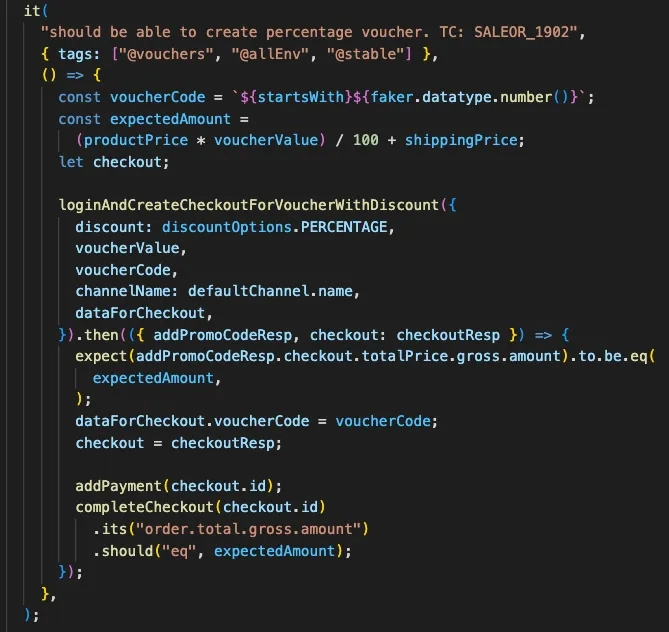

To historia naszej drogi od początków automatyzacji testów, przez adaptację nowych narzędzi, aż do miejsca, w którym jesteśmy dziś - ze stabilniejszym i wydajniejszym frameworkiem testowym.

W Saleor niedawno przeprowadziliśmy migrację naszego zestawu testów end-to-end z Cypress na Playwright. W tym artykule dzielę się naszą podróżą, wyzwaniami, na które natrafiliśmy, i tym, jak przebiegała cała transformacja.

Decyzja o zmianie jednego narzędzia na drugie nigdy nie jest podejmowana lekko. Trzeba ją dokładnie przemyśleć, bo może wpłynąć na cały workflow i stabilność naszych projektów.

## Jak to się zaczęło

Cofnijmy się do 2020 roku. To początek pandemii, a ja właśnie zaczynam dodawać pierwsze testy end-to-end dla storefrontu, napisane w Cypress. W tamtym czasie nie mieliśmy jeszcze skonfigurowanego CI/CD - historia GitHuba pokazuje, że nasz deployment workflow powstał dopiero w 2021 roku.

## Dlaczego wybraliśmy Cypress w 2020 roku

Jedno było pewne - potrzebowaliśmy automatyzacji. Na rynku nie było zbyt wielu narzędzi do wyboru, więc decyzja była prosta. Ciągłe problemy Selenium z driverami i debugowaniem sprawiły, że ta opcja odpadła. Cypress był bardziej przyjazny dla użytkownika i był wtedy na topie - przyszłość automatyzacji end-to-end wyglądała obiecująco.

Z biegiem lat nasz zespół QA rósł i mieliśmy coraz więcej testów. Około 2022 roku zdecydowaliśmy się na płatną wersję Cypress, żeby korzystać z dashboardu (dziś Cloud). To była znacząca poprawa - wreszcie mogliśmy uruchamiać testy równolegle!

Wyniki testów były widoczne, zrobiliśmy trochę automatyzacji z GitHubem. Do dziś korzystamy z botów, które informują nas, czy release ma jakieś niezdane testy, czy nie.

## Playwright na horyzoncie

Jak w każdej dobrze prosperującej firmie technologicznej, śledzimy nowinki. Playwright zaczął zyskiwać uwagę i zaciekawił mnie jako nowe narzędzie. Byłam jednak nieco ostrożna - Playwright był wtedy nowy, a jego społeczność dopiero zaczynała rosnąć. W porównaniu z nim Cypress był dojrzalszy, lepiej udokumentowany, miał bardziej ugruntowaną społeczność, a my mieliśmy z nim doświadczenie.

Mimo że napotykaliśmy spowolnienia i problemy z Cypress, obawiałam się pochopnej decyzji o zmianie frameworka testowego. Poza tym - kto znalazłby czas, żeby przepisać wszystkie nasze testy z Cypress na Playwright?!

Z dnia na dzień, artykuł po artykule, stawało się jasne, że w końcu będziemy musieli dokonać zmiany. Uruchamialiśmy testy tak często i w tylu wersjach, że koszt Cypress Cloud stawał się zaporowy. Poprosiliśmy jednego z członków naszego zespołu QA o eksperymentowanie z Playwright w swoim projekcie. Testy działały szybciej, a wiele problemów, których doświadczaliśmy z Cypress, po prostu znikło.

## Cypress vs Playwright

Spójrzmy na porównanie obu narzędzi:

## Struktura testów

Porównajmy struktury testów w Playwright i Cypress.

Na pierwszy rzut oka widać, że Playwright używa `test` do definiowania przypadku testowego i `expect` ze swojej biblioteki testowej do asercji.

Cypress używa `it` do definiowania przypadku testowego i Chai (`expect`) do asercji.

Jak widać, kod testów wygląda inaczej. Playwright używa wzorca async/await, wbudowanego w JavaScript. Cypress z kolei ma własny mechanizm obsługi asynchroniczności, więc nie zawsze potrzebuje async/await. Asercje w Playwright korzystają z biblioteki Jest, podczas gdy Cypress używa wbudowanej biblioteki asercji opartej na Chai.

Dodatkowo Playwright ma wbudowany mechanizm auto-wait. Jeśli oczekiwane sprawdzenia nie zmaterializują się w wyznaczonym czasie, akcja jest oznaczana błędem TimeoutError, co ogranicza flakiness testów. Z kolei Cypress jest zaprojektowany tak, aby automatycznie czekać na pojawienie się elementów w DOM przed wykonaniem akcji takich jak kliknięcie czy wysłanie formularza. Może to jednak wydłużać czas trwania testów.

Jedną z przewag Playwright jest wsparcie dla iFrame. Cypress ma z nimi problemy, co wymusza stosowanie obejść.

Te przykłady dają ogólne pojęcie o różnicach między Cypress a Playwright, ale jest jeszcze wiele więcej do odkrycia.

## Decyzja i wyzwania

W połowie 2023 roku zaczęłam rozmawiać z zespołem QA o przejściu na Playwright. Priorytetowo potraktowaliśmy przepisanie najważniejszych ścieżek, a potem zajęliśmy się mniej krytycznymi, ale wciąż istotnymi testami. Przy okazji tego refaktoru posprzątaliśmy nasze testy, zmniejszając liczbę testów end-to-end na rzecz większej liczby testów integracyjnych.

Na początku 2024 roku wciąż mierzyliśmy się z pewnymi problemami konfiguracyjnymi i workflow.

Pierwszym wyzwaniem było dodanie nowych workflow do uruchamiania Playwright na głównej gałęzi i na pull requestach, przy jednoczesnym utrzymaniu workflow dla Cypress, ponieważ wciąż wspieramy starsze wersje Saleor. Chcieliśmy nadal publikować wyniki testów na Slacku i otrzymywać zwięzłe informacje o tym, czy testy przechodzą, czy nie na release pull request.

Obecnie każdy pull request uruchamia testy Playwright równolegle. Dzięki temu testujemy tylko najnowsze zmiany.

Stworzyliśmy też workflow dla testów nocnych, które uruchamiają się trzy razy w tygodniu.

Wreszcie mamy możliwość uruchamiania testów przez GitHub Actions - można je odpalić na wybranej gałęzi lub tagu.

Potrzebowaliśmy dodać powiadomienia na Slacku. Chcieliśmy otrzymywać zwięzłe informacje o tym, czy testy przechodzą na release pull request.

Dlatego gdy release pull request jest gotowy, testy uruchamiają się automatycznie, a wyniki trafiają do TestMo (narzędzia do zarządzania przypadkami testowymi i wynikami, którego używamy). Jeśli jakieś testy nie przejdą, dostajemy powiadomienie na Slacku i komentarze na release pull request. Jeśli wszystkie testy przechodzą, następuje auto-merge.

Przed nami wciąż trochę pracy, a testy Cypress nadal wspieramy dla starszych wersji Saleor.

## Podsumowanie

Podróż Saleor od Cypress do Playwright pokazuje ewolucję naszego frameworka do automatyzacji testów. Zaczynając od Cypress w 2020 roku, przeszliśmy na płatną wersję, żeby wspierać równoległe testowanie. Rosnące koszty i problemy z wydajnością skłoniły nas jednak do eksploracji Playwright, który oferował szybsze wykonywanie testów, szersze wsparcie przeglądarek i lepszą kontrolę nad interakcjami.

Mimo początkowych wahań, w połowie 2023 roku rozpoczęliśmy przejście na Playwright. Napotkaliśmy wyzwania konfiguracyjne i workflow, ale wdrożyliśmy nowe przepływy pracy dla testów równoległych, nocnych i integracji z GitHub Actions. Co ważne, developerzy uznali, że łatwiej jest im wejść w testy Playwright w porównaniu z Cypress. Choć dla naszego zespołu QA początki były trudne, nasze testy są teraz szybsze, stabilniejsze i lepiej zorganizowane.

Na początku 2024 roku wciąż wspieramy Cypress dla starszych wersji, ale kontynuujemy rozwój naszego frameworka testowego opartego na Playwright, dążąc do większej wydajności i stabilności w naszym pipeline CI/CD. Jestem dumna z naszego zespołu za tę zmianę!
