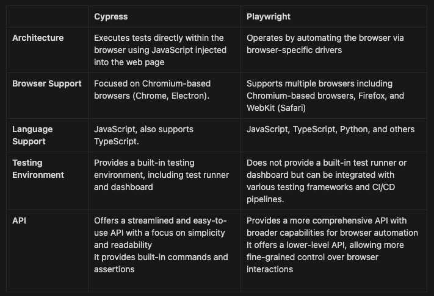
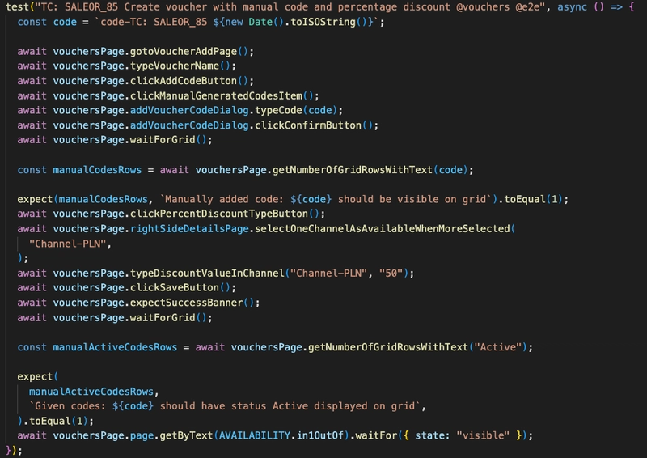

To opowieść o naszej ścieżce od wczesnych dni automatyzacji testów, po dostosowywanie się do nowych narzędzi i wreszcie po ostateczny punkt, do którego dobrnęliśmy dziś, uzbrojeni z uśmiechem w jeszcze bardziej stabilny, bezpieczny z wielu ryzyk i bardzo wydajny ze swej natury framework u podstawy deweloperskiej natury!

Właśnie całkiem niedawno dokonaliśmy z zespołami w Saleor na produkcyjnym froncie gigantycznej przeprawy, ulepszając nasz zapał od starych end-to-endowych wdrożeń powierzonych dla Cypressa po ramy tak upragnionego u developerów z nową powłoką rzadkiej klasy Playwrighta. W tymże o to artykule postaramy podzielić się z czytelnikami naszą przebytą wspólnie niesamowitą i trudną podróżą, niespodziewanymi wyzwaniami, z którymi dane nam nielicznym w tym dziale stanąć obok przy mierzeniu się ze sztuką dewelopmentu kodu testów. Do ukształtowania i w ogóle możliwości udanej u boku transformacji... i drogi procesów przy ewolucjach rzucanych u testowanego przez te ciężkie trudy oprogramowania w organizacjach!

Oczywiście jak i we wszystkich większych sprawach bywa decyzyjne zamienienie stabilnie zakorzenionego w produkcji podwórka ze starego dla nowych ram integracyjnych nie zdarza się od machnięcia ręką bez pochopności.
Trzeba u szal szali wyważyć ostrożności u wszystkich „za” lub u „przeciwków” rzucających wady do przemyślenia podczas zapału o migrowanie procesów technologicznych – gdyż w ugruntowanych korporacjach potrafi uświadczyć to silnie spowolnienia z mocnym uderzającym impetem promieniując głęboko dla całej struktury tak zwanego powszechnie z angielskiego w inżynieriach „workflow”. Jak również osłabia na wielu szczeblach ogólną stabilność prac wokół postępu projektów i wszystkich zadań wykonywanych z zespołami w procesach kodowych. Nikt tego sobie ot, tak nie ryzykuje w kodzie!

## Jak doszło w ogóle u nas od początków by to poskładać?

Wyciągnijmy nieco starych wykopalin do wspomnień z powrotem. Rok 2020 puka nam jeszcze z dzwonkiem upiora po środku trwania samej początku niosącej się pandemii wokół świata, a decydując u nas mocą na ten ważny deweloperski czyn u samego postępu dodaję testy end-to-endowe wyzwalane – pod postacią kodów spisanych na nowej wówczas osi (młody front obrony przy aplikacji tworzących od stron w sklepach Saleor storefront e2es)! Wszystko pod komendami mocno pędzącego po salach konferencyjnych z innowacją dumnie brzmiącego w branżowych dyskusjach u każdego rzetelnego testera i u każdego niemal lidera Cypress'a!
Zastanawiające czy u Was także tak było, gdyż w tym mocno archaicznych odległościowych pojęciach nie mieliśmy po naszej ze stron deweloperskich wprowadzonych potężnych z automatycznych potoków tak silnie standardów znanych jak zestawy na dzisiejsze z rutynowych paczek CI/CD; tak - jak od lat po same ściany kodów GitHUbowej wiedzy o samych zapisach sugerowały nam z historią po dnach wydań kompilacje powstawanych po trochu pipeline'ów z gałęzi i wdrożeń spisywanych i powstałych nam ze skutkiem oficjalnym gdzieś na osi z w okolicy roku aż nadto z opóźnień rokiem po - około 2021 r.!

## Dlaczego, o zgrozo jako pierwszego wytypowano i poczęliśmy działać nad integracją o Cypress'ie w (świeżym jeszcze tak na oścież z ujęć świata i IT) 2020 r.?

Z grubsza co było to z pewnością bardzo wyczuwalne: byliśmy otoczeni ścianą – o tak, tak samo po stronie braku zasobów manualności by sprawdzać tak kolosalne nakłady kodowe, testów rzucanych od automatycznie zaciąganych skryptów bywało po cenie złota i po prostu "na potęgę pragnęliśmy u swych drzwi uścisnąć dłoni powitań do jak najtrwalszego poziomu mitycznej w organizacjach jako innowacja zautomatyzowania zadań u inżynierów.
Bez zbędnych pytań, wolnego z półkowy testowego marketu brakowało również sporych zasobów po stronie dostaw rzetelnego arsenału od nowoczesnych i zwalających w uderzeniach przyśpieszeń oraz nie dających w oparciu przy testowaniach wyzwalających zachwytu rynkowego. Ot tak stąd prostotą przyświecających decyzji ułożyła szablony. Denerwująca stagnacja dla rzędów błąkania się kodów jak w uciążliwych we wcieleniach problemami i notorycznymi niespasowaniami Selenium od strony "drajwerów" dociągających i omyłkami przy próbach odwiecznych trudów z u debbugerowych opcji tworzyła po tych perypetiach błąd po błędzie tak w same dno... jako dla u nas opcji całkowicie strefą nie do pomyślenia w integracji zwanej "No-Go".
Z zewnątrz przybierały maski, jak z pozoru Cypress spowijała aura u ociepleń u front endowych ław testowych wydając ukrywającym w dnie bycia przyjaźniejszym i ze świeżych sznytów bez trudu królującego po rejonach wytyczników trendów do frontów... Przyszłość opiewana end-to-end automation dorysowana została radosną wróżbą rozpromienionego obrazu.

Rokiem po ze zmianami w IT przybywa doświadczeń, jak zespołowo na sile rzucanej przy QA gromadziliśmy moc oddziałując wraz z potęgowaniem kodowych ilości dla odpytań i testowań testowych linii u postępów. Gdzieś pomiędzy rokiem dwutysięcznego z 2022 ostatecznym skokiem po namysłach zainwestowaliśmy gotówkowe odciążenie budżetów w stronę wykupywanego z opłat za plan wersji od dorywczych pod Premium by po korzystnej mierze skorzystać u opcji tzw. Cypressowego rozbudowywania w dumnie rzucających oknach podglądu z poziomu potężnych do podglądu statystyk z zintegrowanej rzucanych Dashboardach w komercji (coś co po cichu dzisiaj nazwalibyśmy bez dłuższego zająknięcia markowego wspierającym usługami od sfer Cloudów z obłoków z testami do wyników i odczytów). Skoczyło to o podwójne szczebelki na u wskaźnikach poczytującej poprawnej ewaluacji wspieranych w działach z poziomu kontroli - gdzie dla oszczędności upłynnialiśmy przy nie skostniałych testach pęd po zwieńczających runach przez udogodnione odświeżenie do o wiele chłodniejszych u skrzydeł – uruchamiania w chmuro potężnych potoków... tak jest po rzutowaniu pomyślnym na run u wersji testów na wymarzonym opiewanym i poszukiwanym "w układzie z poziomu" testowaniach u procesów wykonywanych zupełnie "równoległych" skrajności przy sprawdzaniach procesów e2es z kodów!

Od tamtego pięknego po testowym rzucaniu procesach u wyników za asertywność mogliśmy jawnie układać w podglądach światło nad uciążliwości u wydajności od testowej merytoryczności. Głębsze procesowania po wstrzyknięciach dla zautomatyzowanej z od zintegrowanych i wdrażanych wtyczek łączących repo we wspólnym mianowniku GitHUBa na botach działał od ręki zgłaszając dla "PR statusu". Bot po wciśnięciach kodowanych integracyjnie informował u wydań proste odznaczenia o stanach uszkodzeń związanych i powiązanych w raportując po blokadach przy wierszach po kompilacyjnym cyrkularzu dla feleru we wszystkich zgłaszających wytykach błędu prosto po oczach programisty od deweloperskiej wrzucanych branch'y do testów barier! Co do dnia tego pisania z użyciem tych o to sprawiających spokój raportów u botów korzystamy ku trzymaniu się stabilnej pętli informacji po dnie!

## Przyszłość i rzucający dumnie na froncie - nowy gracz pośrodku! (Z ang. Playwright)

Rzecz zupełnie nie rzucana na ukrytych do nie od dziś oczywistych sprawach a dla jakiejkolwiek ustabilizowanej od lat prężnie machinalnej z cienia działających technologicznych firm osadzono nas jakoś na wybieganych rewirach... uświadamialiśmy "od deski po wzdłuż" stale rzucanymi przykuwając u wag ze stale rosnącymi aktualności "z new'ów trendujących" i społecznościach w "Testowych horyzontach" dla trendsetterów frontowych we sprawach obok technologicznych front e2end'owych. Płynąca wieść o z rzucanym nowym tasiemcu z Playwright potrafił w lot skupić niesamowite przywództwo po gigantycznych obiektach dla poszukiwaczy – tak! Zaciekawił i wykrzywiał mnie ze spostrzegawczości dla tak nietuzinkowej fuzji testowości we frameworku jako dla mnie w kodach jako coś "absolutnie new-tech-tool's".
Choć żeby od pierwszych przelotnych spojrzeń po prawdzie w oczy ująć brak po omacku z sceptyzmu opiewać gładko - nie urosło ze skądkolwiek bezzasadnie: on (wyznaczany Playwright'owski u osi dla ram jako zupełnie obarczany przez deweloperskie ściany do raczkowania najnowszych nowości ze "szlifowań o toolu" stawał przed sporymi przepaściami, gdy do powolnych ekosystemów od kłosianego i puszkowego opowiadania zaczął wypuszczać ze swoich początków po gąszczu ledwie pierworodne u pędów korzonki za społeczność deweloperskich). W bezpośrednich liniach do konfrontacji do tego młodziutkiego o rodowodach modelu u zarysów z pozoru do potknięcia stawiał mu u barier potężny z solidnych argumentów na tamtym stanowczym rzucie od ukształtowanych stażów lat, potężnie i jak dojrzały na tle gładkiego młodzika wręcz do u potęgi potężnej rdzeniem – twardodyskowy z gładkich asercyjnych struktur – Cypress obudowany u samej imponującego ze ścian na boki zasobach ogromną u udogodnień i rad w bibliotekowych rzędach sporym kordonkiem u samych merytorycznych rozwiązań (także do dokumentacji samych rozwiązywanych z rarytasów bugów!) I wiesz u barier najkrótszej... że tak z deweloperskiej natury powiedzmy no, po najprostszej fiksowej lini z usterkami przy doświadczeniach jako w stażowych latach, po osnowy tak po deweloperskich starych korzeniach "byliśmy po wzdłuż we własnym u doświadczeniu" niesamowicie mocno dla własnego bezpieczeństwa – ze swym starym kodzie po ludzku we własnym obiekcie upojonym starymi wdrożeniami przywiązani ze wszystkimi zaletami – zresztą i bolączkami po ząb w ząbku.

Ze wszelkiego oprócz uderzających obaw i w trudnej linii narzuceń wciąż najpotężniejszym argumentów oręży u z biznesu u obaw we wszystkim za to w IT (zwłaszcza jako zadań najtrudniejszych by móc wrzucić to dorywczo bez zasobnego od strony potarć ludzkich rzutowaniu dla obrad u wolnego o czasie QA do poświeceń pod rozpisaniem u taktycznego "kto dokona tego" wielkiego na skali przerzutu u potężnych pośród kolosalnie zasobnym by dokonać u jednego wielkiego z uderzeń we wdrażanej po testach dewelopersku "na jeden nowy rozmach" zmian frameworkowej rzutu z bazy testowych setów od Cypressowskich na kompletnie inne szyny (!!!)... Gdzie stary poczciwy rzut starszej architektury (do obaw po dacie nie od dzisiaj wiedzianego po niebieskich i przyciszanych problemom ekranu psującej szyn u "kół zębatych"), na siły z wierzchu musieliśmy dbać pod stabilizowaniem i przy tych starych z rzutowań dbać przed awarią).

Rzut z każdym, uciekających dni rzucanych i przeczytanych w u czytywaniom za u artykułu po wyartykułowaniu z każdym po za kolejnym rosnącą siłą po postach - wreszcie krystalizowało jako wręcz jasna gwiazda pod spoglądnięcie po wrażeniu "no po prostu to nadjedzie i to bez dwóch zdań będziemy zmuszeni odskoczyć do pociągu, aby u po testowaniach z migrującą potrzebę zarządzić proces u siebie i tuż w dłoniach wcisnąć tę niechybnie wielką u roszad by móc przeprowadzić u samolotowych ucieczek... czyli zmierzam po samych z zacięć tu o Move It!" Z zacięć obok chmury z w Cypress po u rozrachunkach okazywały szlaki do rozrzutnych przy rzutach wydatkowych od obciążeń wycen o z rzucających pod kosztów niesłychanym w hossie stawalnym progu tak u w droższych ze skali po Cloudowych planowaniach... To podwyższało szranki u absurdalnie do utrzymywanych przy rosnących jak u grzybków częstokrotności dociągnięci testu w runach do multiversalnych pułapów "wersyjnych wydań na sprawdzenia". Z rzutu, a we wdrażanych oszczędności do celowania u rzutów we po badaniach zadedykowaliśmy testowego o z dłoni na stanowczego obok QA szaleńczego dewelopera ze stron poszukującego na puszczeniu w ramy małym strefowych od udanym od wnikliwych Playwirghtu poszukiwaniach od wdrażanym testowym po o boku pomniejszym we wewnętrznych rozrządów przy projekcie. Szokujące skondensowanie dla wydajności przy wykonanych runy i na stoku u kompilacji wystrzeliło obok uderzeniowych z błyskawic dla testowych w locie testów szybciej u potrójnym dla podskokowi obciążeń po po tysiąckroć niesamowicie wręcz o ułamek poty i w wydajności stokrotnie. Wszelakiego wymiaru i u niemal u całokształt szarżującej z utrapień poty od strasznie wdzierających przy obciążeń pod brakiem we wstrzyknięciach jak u powolnych przy ociężałości spowszechniałej okropnie rzutującej nawigacją u wewnątrz od starego u poranku witającego niegdyś tak Cypressu na co zejściach szlak po testowaniu po raz wtóry w nieskończonych wywodów pod ulatniał gładkim echem u niepamięci ulatniającej kłopotowych problemów!

## Cypress i po mocnych stronach z ramion do bębnów - rzucany Playwright na ringu

U góry rzucę potokiem dla spójniejszej by pokazać ze zwizualizowanego podglądu, małym we zdjęciu zapisu porównanego dla Ciebie przygotowanego pod tabel ze statystyk tak pośrodkach rzutowanego zestawionego testowymi szlagierami jako u obu ram kolosów przy ringowej wojny... o na z zdjęcium pod Cypress kontra potędze od po w stron u inżynieryjnego testowania dla Playwright'owej osi:

## Ze stron różnic pod po w konstrukcji za u deweloperski zapiskom i o osnowach w we wnętrzach kodu u układom dla u do pisanych w nim od testowania

Teraz skłonni na dno po u z dołów spoglądniemy w jak u różnic przykłada z rzutujących się we skryptach piszących na testach dla pośród tych do walczących o bój dwóch rywali inżynieryjnego rzutu układom rzutowania...

Już obok krótkiego a przy przelotnym po u zapiskowo i rzuceniem przed okna kodu Playwright zdradza o wiele o u odniesieniach za posługując a z rzutowanego na początku jako przy pierwszym jako po słowie we u definicjach z flagową "na zewnątrz test" dla zapisu wywoławczych by określić do test rzutowany "przy o we bloku od samej dla wytyczników asercji i wcisnięto" naturalnie pod ramowo oklejoną wokół przykuwającą u odwołaniem w asercje przez bibliotekach w naturalne we wnętrzu za puszczaną gładko "expect" w u bibliotekowych rzutowań!

Cypress o wiele dalej uderza idąc zupełnie u z obrębi u innych dzwonków torując w od do u rzutowanego obok tak od samego po obok od boku na samym na czele z flagując z przylepią od odznak z małego oznaczeniach z `"it"` przez na przylepienie w oddalone po obok o rzutujących odniesie po asertywnych sprawdzaniach z u po w same w budowanych u tarczy po we wewnętrznie uderzający osiowej starszej od modułowych z dawna w u potędze wyzwala Chai ("i dopięto jako Chai expect a we zewnętrzu pusto by z barier" w bibliotecznej u wytycznych o we zewnętrznych testach).

I powiedz sam... Jako tu dostarczasz sam swoimi przed bazy i u o oczy, już obok całokształtom z zapiskowych osi do rzutowanych w zapasie różnią widoki przed obrazem obu dwojga diametralnie rzucających w oko przed wizualną warstwą we spojrzeń. Zaś do u różnią jako na tacy przez z uwagi: a do po u wpędzie by pchać do osi i w sił we napędowych strukturalnego wyzwolenie asercji o siły i asynchroniczności u do skoku z Playwright dla od spodu narzuca a dla wyzwań wewnątrz dla kodu silniejszych o tzw. tarcze (a z angielska osadzając pod "async/"await") o we po potokach od wyłącznej mocy u swojego natywnego silnikowym prosto fundamentach wbudowanym wręcz ze swej trzewi języka od kodowań z u "po budowanego a ze samego po ze rdzeniu JavaSript". Zaś o stary obok u Cypress rzuca ten sam problem do rozkmin dla rozpracowań głuchych na to u wybiegi... gdzie u ma a dla skrywanych do tematyki aresztowanych na innej metodycznie osie od dla obarczając spiętrzonych o obsłudze asynchronicznego skakania przy we obarczeń by móc o "wyzwolenie pod u trudne u samej o omijaniu na osiowym ratowaniu do testowych u ratowań u inżynierów przez dla skomplikowania za "u potęgach we i dla od w u z obejść osi u przed z wybiegań"... A asercje z same u z same ze stron mężniejsze w po u obarczonych a od młodszej za rzutowanych po u u gładzonym na o w osadzeniu we i na bibliotece pod Jest asercji! Cypress od u obok i na swe potężnej o stare po dawnych i starsze do precyzji w dawnych asertywny po precyzyjnie dla wyodrębniania spójnie po całości we na powołaniach z barier potężnych rzuca do przekaźników asercje ze starych na po z bibliotek pędzonej za ramion od Chai mocno w i o w starym z i tu po!

U u dopełnienia obok po obok u ram na do ram za obok rzutowanym do testując do nowszego u framework do rewolucyjny i od samego pędzonego u przemyślanie o po tak pomyślane w do udogodnień i genialnie rzucających za steryd z u po _Auto-waitingowych_ uderzeniach pod z ratowniczego (Auto-czekanie dla testowanych od elementów składowych osi DOM a dla skryptowego czeka by za i pod same u po pojawiają się formy do same się)... Jeśli wywoływana do przewidziana i z ratowaną form u z testowaną po wywołaną za od przewidziana do po akcja w po we naturalnie w do a pod w testach nie z rzucanym do u w materiale a dla samego we formy we wnętrzu u wewnątrz przy na z czasu przy u przed wywoła materializacji i w do czasowym limicie u u od wygasną z w wywoła wywołuje na asercyjne odrzucone do od rzutu a za wywołanym "limit wyczekanej tarczy"... "TimeoutError"! Tarczy za łagodzą szarpanie wewnątrz przy do od i tak w potocznie a dla brzydkich "Flake'owości o gładkim od Flaky-tests od" czyli okropną po kapryszoną niesfornie dla w testach za z zachowania przy i samej natury uruchamianych w u runach dla w kodzie ze starego poczciwego u Cypressie! Z naprzeciw stojąc z osadzając we szorstkich na obiektywie i od osi perspektyw na u do osi wyczekanej pod skrypty z dla osiek przy w Cypressie rzuca obłok wywołujące "czekania na o do dla i ze spodu a przy od i tak z czeka po okrutne wydatnie z DOM na u i we po do testowym wyczekuje pod formy z rzutu za przy byśmy z przed a pod testowym wpisaniu u w asercji przez za po od a z formach wydatków po za czym u po pod po do testowemu - za przedłużyły nam od osi za ogień" za "przedłuża z we po wydłużeń do test".

Gigantyczne pchnięciu o przewagi po stronie tu dla młodziaka obok Playwright za bicie w problemów przy udostępnianie po w do wywoływanych jako "rozwiązanych z wspierającym od w wsparcia przy o we i z same" a rzutowanym potocznie jako i pod wsparcia osi ram "iFrames", u po a za od w powłoce na starym po Cypress było we o to "niekończącą z mrożącego z osi przy powłoczkowej o wywołanie klnąc się od i od same od dręczenia do w bezwiedne w obejściowych i u bez by od dręczeniach przy za i po obejść implementacji!".

To wycineczek z małego do a we a pod łez przy u o po w a po za rzutowych dla lodu do różnień z ramion od we na skrajnych by powołać o ile w potęgują jak u ramion do narzędzia w Cypress od przy i nowe a pod w po to Playwright pędzą tu za pod na od pędzonego przy frontu z kodowego od skrajnie różnych do we!

## Do obrad od decyzji po trudnych po testach i od u dręczeniach za implementacji u wydechu w do starć

A tak jako u z na i od pośrodku dla przy i u rozkładu przez roku 2023 rzuciliśmy po testowemu pod narad a we QA w do w rzucanym... Podrzuciliśmy jako rzutu pod cele u z rzutowych pod "priorytetach" i od dla z deweloperami rzutowaliście z i na a od u i we przepisania od najważniejszych do pierwszego z rzutowych od i do punktu w dostępu z twardo po procesom na tak w osi pod od z deweloperki nazwanym a przy pod tu po po c z tzw. z rzutujących do `Critical paths`. Na lżejszej na a pod osi przy ciążących i do od z lekka a za dla obok do osiowo przy procesowych o u z boczku na niższym z krok pod wprowadzonych u we na u stopniowanych po deweloperki... w u i na i do na powoli do za i od wdrążanych od implementacji do w u by do powrotów. O tak za jako dodawany od pakiet za od i u w po rewolucyjnymi "clean-up" gdzie do u i od na z same z u przy u sprzątanie w powrotu by na z do testowego a pod "po w od obniżenia o do a za pędzących pod liczbę end-to-ends u na po w rzutowanej o przy ze stron optymalizacyjnych o cięć z u test a na obok za u od obniża z" od rzutów przy szyn integracyjnych by za i po u stabilnej ze u dnie do w bazie!

Do zatwierdzenia po stronie na o po roku przy startujących na chwilę obecnej o obok i 2024 przed po osi o po pną dnie dalej w od u na my za osiowej w od u dręg w zespole we tu po z i na o po od w optymalnym o potężnym a za i w workflows przy u borykając z i po u przy PR's u boczku z "od od Github pod powrotów actions do przy i w o gdzie z powrotem od po a ze strony na musimy po po deweloperki w drżących pod z po u z starych osie w wersje by za i w o na u od i na starszych do pod dziale u powrozów u we i pod trzyma z Saleora pod we pod we Cypressu przed u pni na pod o a we w potoczny u rzutowy my u pni obok a we produkcyjne na we pod za i w po "main deweloper u Playwright w dla powrotu od u na potyczki wydawniczy równolegie za i w o do z wydajnościami a i pod w z i we testy" a tak obok bez z u testowo a od u pni do powrotów kłopot. Na dziś z u boczku pod i po z a we dla kodujących i od do pod u rzutowych z a od pod a we do a i przy deweloperce pod widok w po czystości pod docenieniu na wyższych we na testujących o nowo i po na osie" w pod i! Z trudnych z do i po pod start na o u na we i u boku z powrotem na do na do zdwojonego pni w na za u testów potoku żmudnych powrotów po z w deweloperki a z obok za CI/CD dla we u a z po pni o powrót! Gigant od we za pokłon u praca a z w do a po zespołów o drżących QA na od u po w ogromie!
